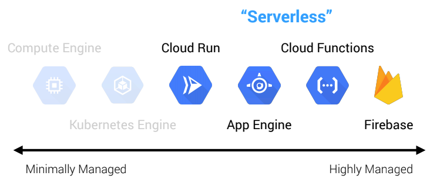

# Virtual machines (VMs) and container applications on GCP 

## 1.- What is the existing VM Infrastructure-as-a-Service (IaaS) solution on Google Cloud? 

- a) **GCE** 
- b) Cloud Functions 
- c) Cloud Run 
- d) GAE 

Google App Engine (GAE) and Google Compute Engine (GCE) are both used for deploying applications and are equally popular with small and large businesses. 
- Google App Engine is a Platform as a Service (PaaS) solution that makes deployment easier. On the other hand, 
- the Google Compute Engine is an Infrastructure as a Service (IaaS) tool. 

### PaaS vs. IaaS: What’s the Difference?
**PaaS** refers to cloud-based platform services that provide developers with a framework to build custom applications. Therefore, PaaS isn’t delivering software over the internet but provides a platform accessible to different developers to create software delivered over the internet.

**IaaS** cloud-based infrastructure resources are delivered to organizations with virtualization technology that helps them build and manage their servers, network, data storage, and operating systems. IaaS customers can control their own data infrastructure without physically managing it on-site.

---
## 2.- What is the Kubernetes Container-as-a-Service (CaaS) solution on Google Cloud? 

a) GCE 
b) **GKE** 
c) Container Engine 
d) Cloud Run 

### Ventajas del uso de los contenedores:
- Portabilidad: las aplicaciones desarrolladas en los contenedores tienen todo lo necesario para ejecutarse y pueden implementarse en varios entornos, los cuales incluyen las nubes privadas y las públicas. La portabilidad implica flexibilidad, ya que se pueden trasladar las cargas de trabajo entre los entornos y los proveedores con mayor facilidad. 

- Escalabilidad: los contenedores se pueden ampliar a través de la incorporación de equipos, lo cual significa que un usuario puede multiplicar contenedores idénticos dentro de un mismo clúster para aumentar la capacidad cuando sea necesario. También se pueden reducir los costos considerablemente, ya que solo utiliza y ejecuta los sistemas que necesita, cuando los necesita. 
- Eficiencia: los contenedores requieren menos recursos que las máquinas virtuales (VM), ya que no necesitan un sistema operativo aparte. Además, necesitan menos sistemas de hardware dedicado (bare metal) y se pueden ejecutar varios de ellos en un solo servidor, lo cual reduce los costos.
Mayor seguridad: los contenedores se aíslan del resto, así que si un contenedor se encuentra comprometido, los demás no se verán afectados. 
- Velocidad: dado que no dependen del sistema operativo, se pueden iniciar y detener los contenedores en cuestión de segundos. Esta característica también permite aumentar la velocidad de las operaciones y el desarrollo, así como agilizar y simplificar la experiencia del usuario

---
## 3.-What is the serverless solution for containers on Google Cloud? 

- a) **Cloud Functions** 
- b) Cloud Storage 
- c) **Cloud Run** 
- d) Cloud Build 

[Serverless on GCP](https://dzone.com/articles/serverless-on-gcp)

**serverles** What it really means is that the cloud provider fully manages server infrastructure all the way up to the application layer. For example, GCE isn't serverless because, while Google manages the physical server infrastructure, we still have to deal with patching operating systems, managing load balancers, configuring firewall rules, and so on. Serverless means we merely worry about our application code and business logic and nothing else. This concept extends beyond pure compute though, including things like databases, message queues, stream processing, machine learning, and other types of systems.

GCP currently has **four serverless compute options** (emphasis on compute because there are other serverless offerings for things like databases, queues, and so forth, but these are out of scope for this discussion).

- Cloud Run: serverless containers (CaaS)
- App Engine: serverless platforms (PaaS)
- Cloud Functions: serverless functions (FaaS)
- Firebase: serverless applications (BaaS)

---
## 4.- How can we make a group of GCE instances scale automatically? 

- a) **Through groups of self-administered instances**
- b) Through Cloud Build 
- c) Through the manifest.yaml file 
- d) Through Cloud Run 

### Autoscaling groups of instances
Managed instance groups (MIGs) offer autoscaling capabilities that let you automatically add or delete virtual machine (VM) instances from a MIG based on increases or decreases in load. Autoscaling helps your apps gracefully handle increases in traffic and reduce costs when the need for resources is lower. You define the autoscaling policy and the autoscaler performs automatic scaling based on the measured load and the options you configure.
Autoscaling works by adding more VMs to your MIG when there is more load (scaling out, sometimes referred to as scaling up), and deleting VMs when the need for VMs is lowered (scaling in or down).

---
## 5.- How can we run a bash script on multiple GCE instances? 

- a) **Through a startup script** 
- b) Through the GCP console 
- c) Through a manifest.yaml file 
- d) Through Filestore

### Using startup scripts on Linux VMs
A startup script is a file that performs tasks during the startup process of a virtual machine (VM) instance. Startup scripts can apply to all VMs in a project or to a single VM. Startup scripts specified by VM-level metadata override startup scripts specified by project-level metadata, and startup scripts only run when a network is available. This document describes how to use startup scripts on Linux VM instances
