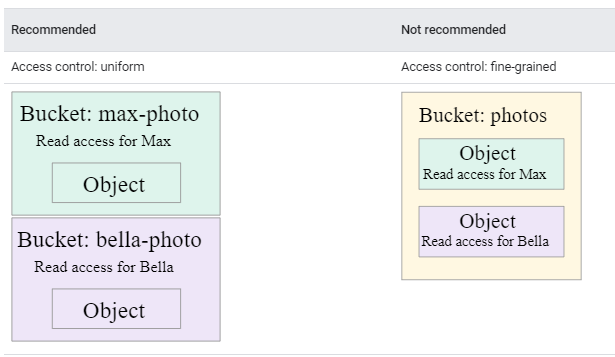

# Handling unstructured data 

## 1.- If you have a web page that is consumed from different places in the United States (US), which type of location would you select for your bucket in Cloud Storage? 

- a) Region 
- b) **Multi-region** 
- c) Dual-region 
- d) Zonal 

    ### Key concepts
    * You specify a location for storing your object data when you create a bucket.
    * You can select from the following location types:
        * **A region** is a specific geographic place, such as São Paulo.
        * **A dual-region** is a specific pair of regions, such as Tokyo and Osaka.
        * **A multi-region** is a large geographic area, such as the United States, that contains two or more geographic places.

[TUTORIAL CLOUD STORAGE](https://www.youtube.com/watch?v=8DMOJ6Lgm7s)

---
## 2.-If you have analytic processing on a compute layer using us-east-1, which type of location would you select for your bucket in Cloud Storage?

- a) **Single-region**
- b) Multi-region 
- c) Dual-region 
- d) Zonal

    Explanation: If we have data-processing scenarios in a particular region, the recommended option is to select a regional bucket in order to improve performance in obtaining data and to reduce latency and usage costs.

    ### Compute Engine VM notes
    Storing data in the same region as your Compute Engine VM instances can provide better performance. This advantage applies to both regions and dual-regions.
    While you can't specify a Compute Engine zone as a bucket location, all Compute Engine VM instances in zones within a given region have similar performance when accessing buckets in that region.

---
## 3.- If you have auditable information that must be stored for 10 years, which type of class would you select for your bucket in Cloud Storage? 

- a) Standard 
- b) Nearline 
- c) Coldline 
- d) **Archive**

    ### Key concepts
    * A storage class is a piece of __metadata__ that is used by every object.
    * The storage class set for an object affects the object's availability and pricing model.
        * You can change the storage class of an existing object either by __rewriting the object__ or by using __Object Lifecycle Management__.
    * When you __create a bucket__, you can specify a default storage class for the bucket. When you add objects to the bucket, they inherit this storage class unless explicitly set otherwise.
        * If you don't specify a default storage class when you create a bucket, that bucket's default storage class is set to Standard Storage.
        * Changing the default storage class of a bucket does not affect any of the objects that already exist in the bucket.

### Available storage classes
Storage Class| Name for APIs and gsutil	|Minimum storage duration
---|---|---
Standard Storage| 	STANDARD|	None	
Nearline Storage|	NEARLINE|	30 days	
Coldline Storage|	COLDLINE|	90 days	
Archive Storage|	ARCHIVE|	365 days	

[Other Informations](https://cloud.google.com/storage/pricing)

---
## 4.- If you need to store all the information that is stored in a Cloud Storage bucket, including changes made to the original files, which Cloud Storage functionality would you use? 

- a) **Object versioning** 
- b) Bucket retention policy 
- c) Object hold protection 
- d) Access control 

    Explanation: An object versioning configuration allows us to store multiple versions of the same object.

    ### Object Versioning
    To support the retrieval of objects that are deleted or replaced, Cloud Storage offers the Object Versioning feature. This page describes the feature and the options available when using it.
    **Caution:** Objects cannot be recovered from a deleted bucket, even if the bucket used Object Versioning.

    ```bash
    gsutil versioning set on gs://my-bucket-project
    gsutil versioning set off gs://my-bucket-project
    ```

---
## 5.- If you need to "control access" to files within your Cloud Storage bucket at an object level, which access method would you use? 

- a) Remote access 
- b) Uniform access
- c) **Fine-grained access**
- d) Unique access

    Explanation: 
    - fine-grained access configuration allows us to control access at an object level. 
    - uniform access, which allows us to control access at a bucket level.

## Choose between uniform and fine-grained access
When you create a bucket, you should decide whether you want to apply permissions using uniform or fine-grained access.

* **Uniform (recommended):** Uniform bucket-level access allows you to use Identity and Access Management (IAM) alone to manage permissions. IAM applies permissions to all the objects contained inside the bucket or groups of objects with common name prefixes. IAM also allows you to use features that are not available when working with ACLs, such as IAM Conditions and Cloud Audit Logs.

* **Fine-grained:** The fine-grained option enables you to use IAM and Access Control Lists (ACLs) together to manage permissions. ACLs are a legacy access control system for Cloud Storage designed for interoperability with Amazon S3. You can specify access and apply permissions at both the bucket level and per individual object.

